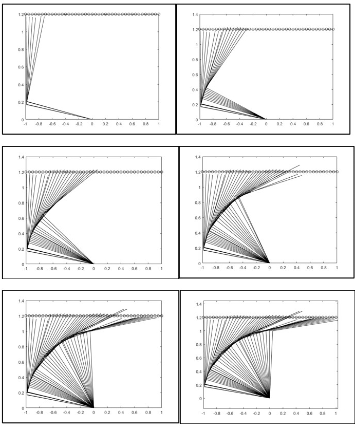
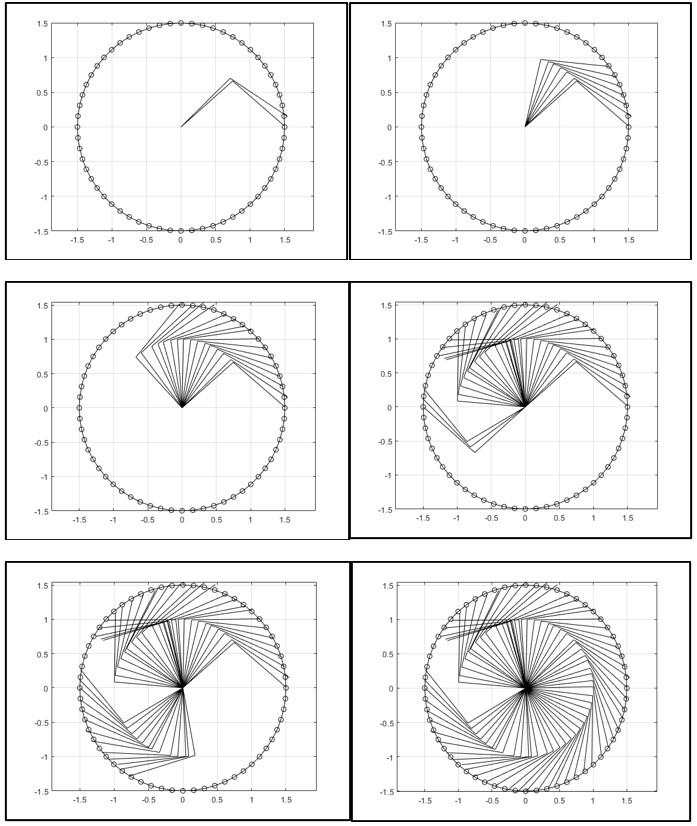

# Forward Kinematics of a 2-Link Manipulator using KSOM

- Direct implement forward kinematics, result and model generated kinematics result compared and tries to optimize the model to reduce the error.
- Extending this model to implement line tracking and circle tracking and finally custom path tracking within range of links.
- This is course project in the subject of Artificial Neural Networks ([EEN-351](https://www.iitr.ac.in/~EE/Dr__M__Felix_Orlando#teachingengagements)).

## Snapshot of tracking line over time

## Snapshot of tracking circle over time

